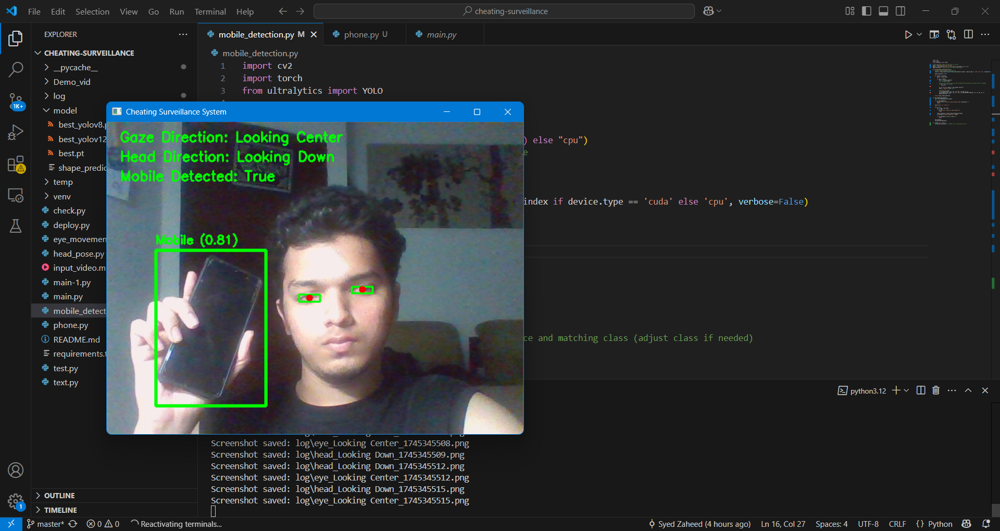
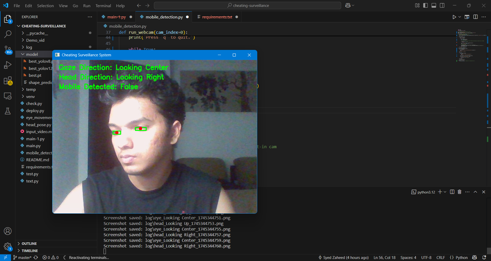
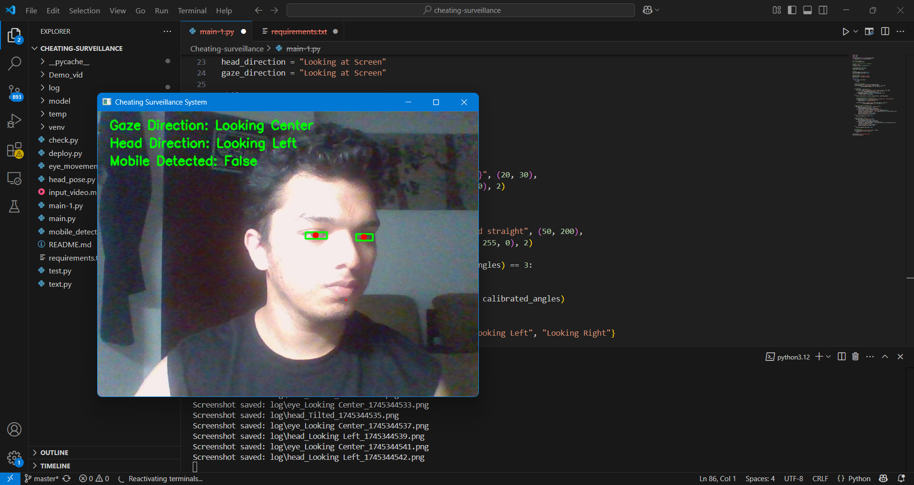
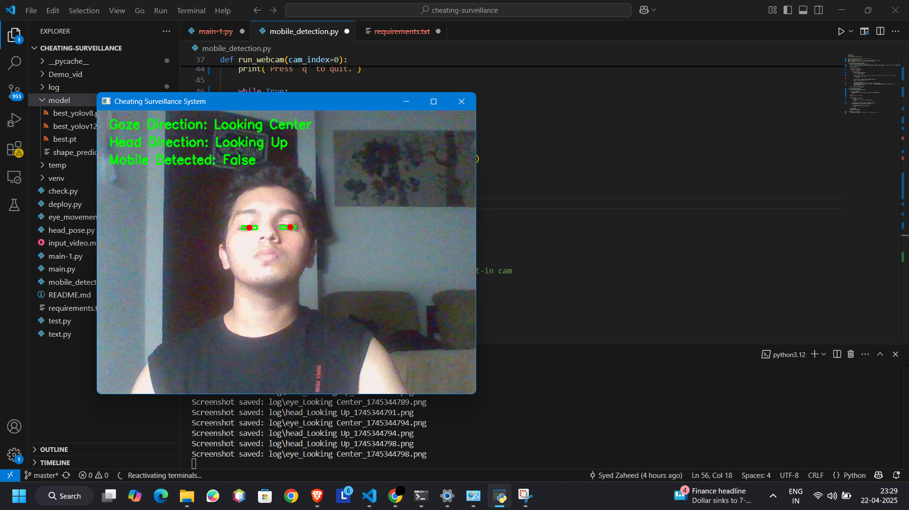
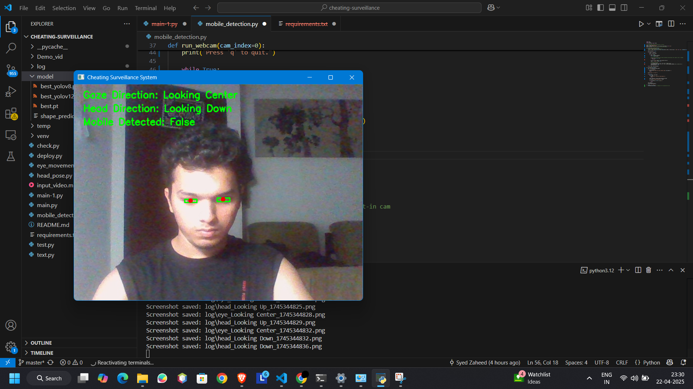

# Cheating Surveillance System

## Overview
The **Cheating Surveillance System** is designed to detect cheating during Online Interviews/Exams by monitoring head and pupil movements and identifying unauthorized mobile phone usage. This system integrates facial landmark detection with **Shape Predictor 68** and object detection using **YOLO**, trained on a cellphone detection dataset from Roboflow.

## Features
- **Head and Pupil Movement Detection**: Uses **dlib's Shape Predictor 68** to track facial landmarks and detect suspicious gaze patterns.
- **Mobile Phone Detection**: Utilizes a **YOLOv12 model** trained on the [Roboflow Cellphone Detection Dataset](https://universe.roboflow.com/d1156414/cellphone-0aodn) to detect mobile phones in real-time.
- **Real-Time Monitoring**: Processes live video feeds for instant analysis and detection.
- **Alert System**: Detects and flags potential cheating behavior, such as excessive head or pupil movement in the left, right, up, or down direction for longer than the allowed time.

- 







## Technologies Used
- **Python**
- **OpenCV** (for video processing)
- **dlib** (for facial landmark detection)
- **YOLO (You Only Look Once)** (for object detection)
- **Roboflow Dataset** (for training the mobile detection model)

## Folder Structure
```
cheating-surveillance/
│── models/                 # Contains trained YOLO weights and shape predictor model  
    |__ best_yolov8.pt
    |__ best_yolov12.pt
    |__ shape_predictor_68_face_landmarks.dat 
│── log                     # Screenshots
│── main.py                 # Entry point for real-time detection
│── requirements.txt        # Required dependencies
│── README.md               # Project documentation
│── head_pose.py            # Head movement detection
│── eye_movement.py         # Gaze Detection
│── mobile_detection.py     # Mobile detection
│── Demo_vid/               # Folder containing demo videos
```

## Installation
### Prerequisites
Ensure you have the following installed:
- Python 3.8+
- OpenCV
- dlib
- torch (for YOLO)
- roboflow (for dataset access)

### Setup
1. Clone the repository:
   ```bash
   git clone https://github.com/Sania-hasann/Cheating-Surveillance-System.git
   cd Cheating-Surveillance-System
   ```
2. Install dependencies:
   ```bash
   pip install -r requirements.txt
   ```
3. Download the **Shape Predictor 68** model:
   ```bash
   wget http://dlib.net/files/shape_predictor_68_face_landmarks.dat.bz2
   bzip2 -d shape_predictor_68_face_landmarks.dat.bz2
   ```
4. Set up the YOLO model:  
   - You have trained your YOLO model on the [Roboflow Cellphone Dataset](https://universe.roboflow.com/d1156414/cellphone-0aodn).  
   - Download the trained YOLO weights and place the weights file in the `models/` directory.

## Usage
### Running the Surveillance System
To start real-time monitoring, run:
```bash
python main.py
```

### How It Works
1. **Facial Landmark Detection**: Detects and tracks head movements and pupil direction.
2. **YOLO-based Object Detection**: Identifies mobile phones in the video feed.
3. **Cheating Behavior Analysis**: Flags abnormal behavior such as frequent head turning or gaze shifts.


## Dataset
The mobile phone detection model is trained on the **Roboflow Cellphone Detection Dataset**. You can access it here: [Roboflow Cellphone Dataset](https://universe.roboflow.com/d1156414/cellphone-0aodn).

## Contributing
Feel free to submit issues and pull requests! If you have improvements or additional features, contribute by following these steps:
1. Fork the repository.
2. Create a new branch: `git checkout -b feature-branch`
3. Commit your changes: `git commit -m "Add new feature"`
4. Push to the branch: `git push origin feature-branch`
5. Open a Pull Request.

## License
This project is licensed under the MIT License - see the [LICENSE](LICENSE) file for details.

## Acknowledgments
- [dlib](http://dlib.net/)
- [OpenCV](https://opencv.org/)
- [YOLO](https://github.com/ultralytics/yolov5)
- [Roboflow](https://roboflow.com/) for dataset support
